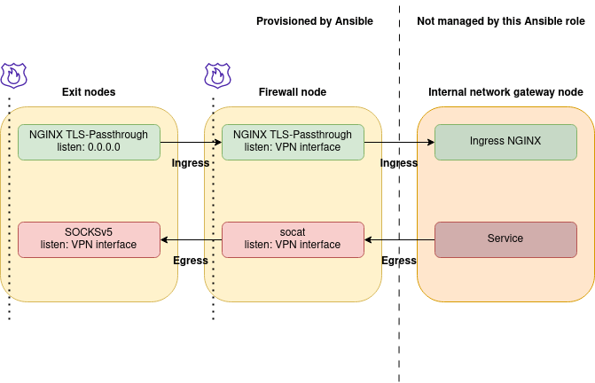

firewalled-zone
===============

Ansible playbook for creating secure networks with double firewalls and load balancing behind internal networks.
Approach is based on proxying ingress and egress traffic using reverse-proxy, SOCKSv5 and HTTP Proxy methods.

**Advantages:**
- Hide real nodes behind two layers of firewall nodes
- Anytime you can disconnect the middle node (`firewall` type) in case when `exit` node was hacked/compromised. No any trace on the node would persist, so the attacker will not even know `internal` node IP
- Introduce additional L4 security e.g. against DoS
- Hide your internal nodes public IP by redirecting traffic through egress proxy (traffic exits on `exit` type nodes)
- Possibility to create a honeypot on exit nodes and then ban intruders on firewall nodes

Architecture
------------

Every node is connected with a VPN. There is a `peer list` defined for each node - only selected nodes can communicate with each other.

**For example:**
- `Exit node` talks only to `Firewall node`
- `Firewall node` talks to `Exit node` and `Internal node`

### Dictionary:

- `Exit nodes`: Nodes hitting the internet. DNS should point at exit nodes
- `Firewall nodes`: Relay nodes between `Exit nodes` and `Internal nodes`, does as a pure bridge that can be shut down anytime to hide your `Internal nodes` from attackers
- `Internal nodes`: Your secure zone. Nodes should not be directly exposed to the internet

Example configuration: one node on every level
----------------------------------------------



### exit-1

```yaml
node_role: exit
wg_internal_ip: 10.223.0.1
peers:
    - name: firewall-node-1
      relation: ["forward-ingress"]
```

### firewall-1

```yaml
node_role: firewall
wg_internal_ip: 10.223.0.2
peers:
    - name: exit-1
      externalIp: 1.2.3.4
      relation: ["forward-egress"]               # `firewall-1` is tunneling SOCKS5v5 egress

    - name: internal-1
      relation: ["forward-ingress"]  # `firewall-node-1` is tunneling TLS+HTTP ingress
```

### internal-1

```yaml
node_role: internal
wg_internal_ip: 10.223.0.3
#wg_port: 51826

# egress proxy accessible for Pods
#setup_egress_proxy: true
#haproxy_bind_ip: 10.50.0.1

peers:
    - name: firewall-1
      externalIp: 5.4.3.2  # `internal-1` knows the internet IP of `firewall-1`
      #persistentKeepAlive: 50
      #relation: ["forward-egress"]  # use with setup_egress_proxy=true
```
