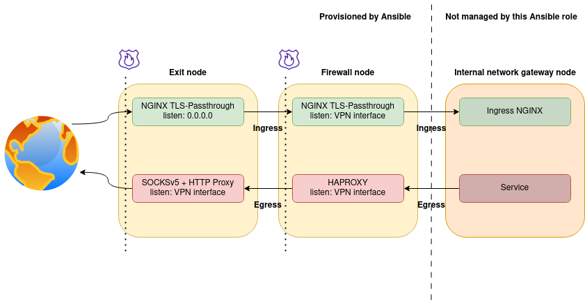

hop-node
========

Ansible playbook for creating secure networks with double firewalls behind internal networks and load balancing.
Approach is based on proxying ingress and egress traffic using reverse-proxy, SOCKSv5 and HTTP Proxy methods.

Example configuration: one node on every level
----------------------------------------------



### exit-1

```yaml
node_role: exit
wg_internal_ip: 10.223.0.1
peers:
    - name: firewall-node-1
      relation: ["forward-ingress"]
```

### firewall-1

```yaml
node_role: firewall
wg_internal_ip: 10.223.0.2
peers:
    - name: exit-1
      externalIp: 1.2.3.4
      relation: ["forward-egress"]               # `firewall-1` is tunneling SOCKS5v5 egress

    - name: internal-1
      relation: ["forward-ingress"]  # `firewall-node-1` is tunneling TLS+HTTP ingress
```

### internal-1

```yaml
node_role: internal
wg_internal_ip: 10.223.0.3
peers:
    - name: firewall-1
      externalIp: 5.4.3.2  # `internal-1` knows the internet IP of `firewall-1`
```
